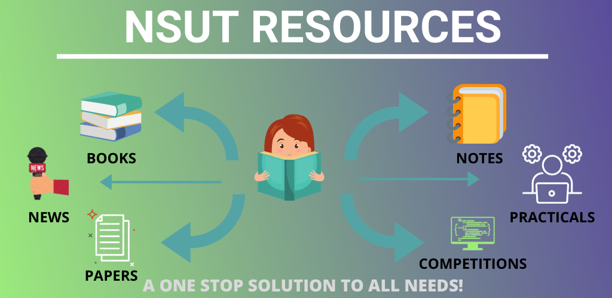
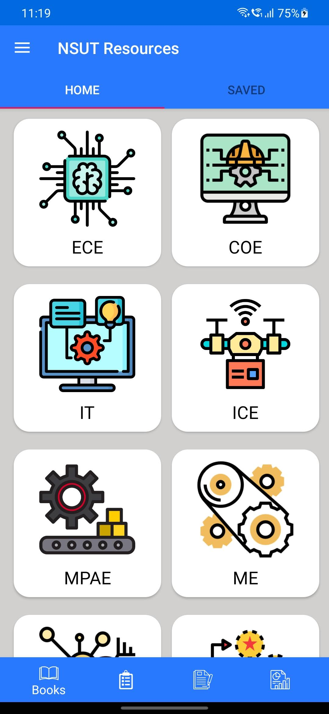
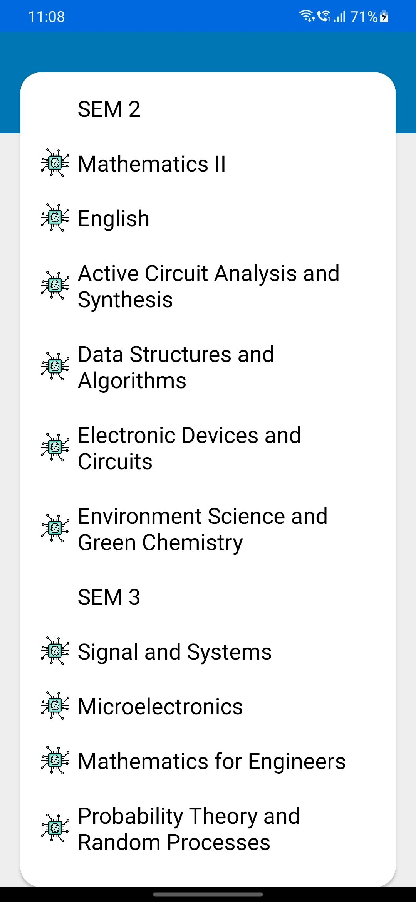
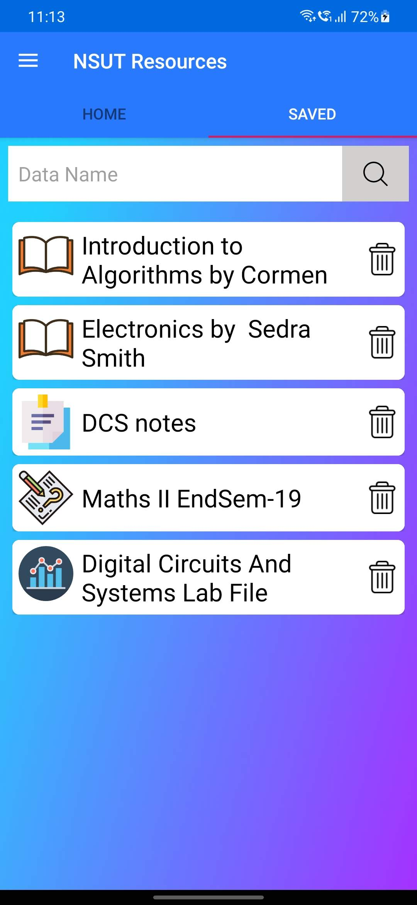
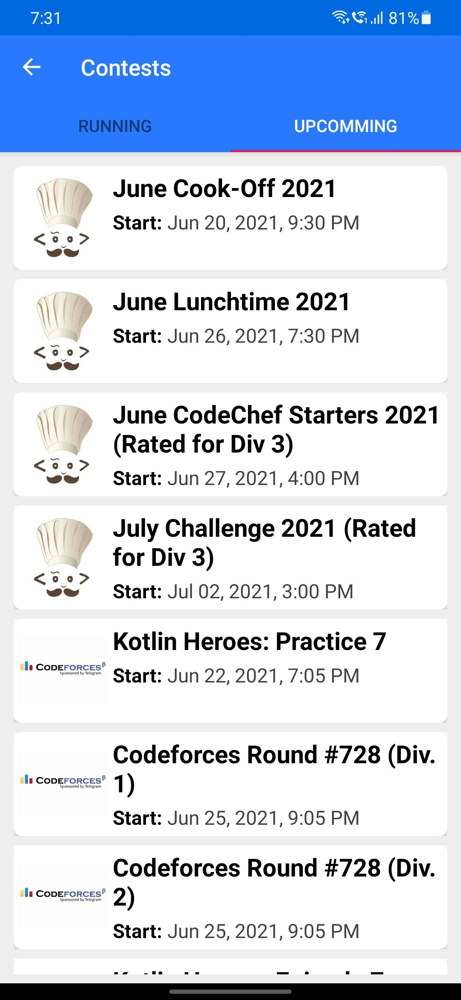

# NSUT Resources
An android app that provides access to all study-related materials for NSUT students and keeps them updated with the latest coding competitions.

## Key Features
1. Uses dropbox api to fetch all the resources (books, notes, papers, etc.).
2. Uses SQLite to store metadata about the resources locally.
3. Uses Jsoup library to parse and extract data from HTML pages.
4. Completely secure application.

## Project Overview

 

<table>
	<tr>
		<td>  </td>
		<td>  </td>
		<td>  </td>
		<td>  </td>
		<td>  </td>
	</tr>
</table>

## Contributors
[Samyak Uttam](https://github.com/samyak-uttam) and [Ankit Kumar Mishra](https://github.com/anky008).